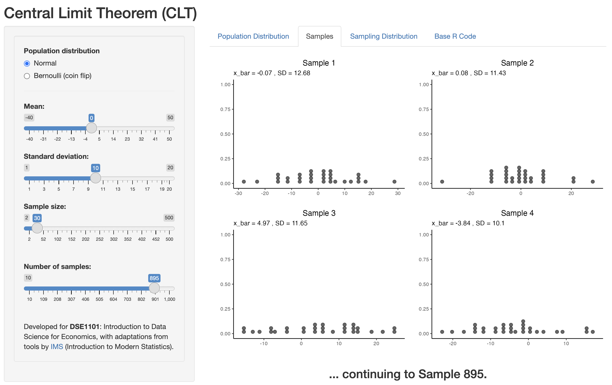

# clt-app

This is a simple ShinyApp that demonstrates the Central Limit Theorem (CLT) through simulations. 

Access the app [here](https://ythuangy-clt-app.share.connect.posit.cloud/).

### Features

+ Generate a sample from a Normal or Bernoulli distribution with user-defined parameters.

+ Simulate repeated sampling, compute sample means, and visualize the sampling distribution for the sample means.

+ View the (base) R code for sampling and plotting.

### Learning outcomes

By interacting with the app, students will be able to

+ Understand the Central Limit Theorem for sample means

+ Interpret the mean and standard error of a sampling distribution.

+ Connect theory to simulation outputs with reproducible R code.

The app was developed for [DSE1101](https://nusmods.com/courses/DSE1101/introductory-data-science-for-economics) with adaptations from tools provided by [Introduction Modern Statistics (IMS)](https://www.openintro.org/book/ims/).